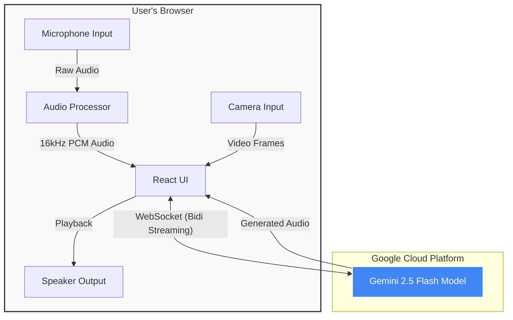

# System Architecture

This diagram illustrates how the Lumi AI Tutor connects the user's browser to Google's Gemini Live API.

## Data Flow Description

1.  **Input Capture:**
    *   **Audio:** The browser captures audio via `navigator.mediaDevices.getUserMedia`.
    *   **Video:** Video frames are captured from the camera feed.

2.  **Processing:**
    *   Audio is downsampled to 16kHz PCM (required by Gemini).
    *   Video frames are resized and compressed to JPEG base64.

3.  **Transmission:**
    *   The React app establishes a persistent WebSocket connection using the `@google/genai` SDK.
    *   Audio chunks and video frames are streamed in real-time to the Gemini model on Google Cloud.

4.  **Response:**
    *   Gemini processes the multimodal input and streams back generated audio chunks.
    *   The app queues and plays these chunks using the Web Audio API for seamless playback.
